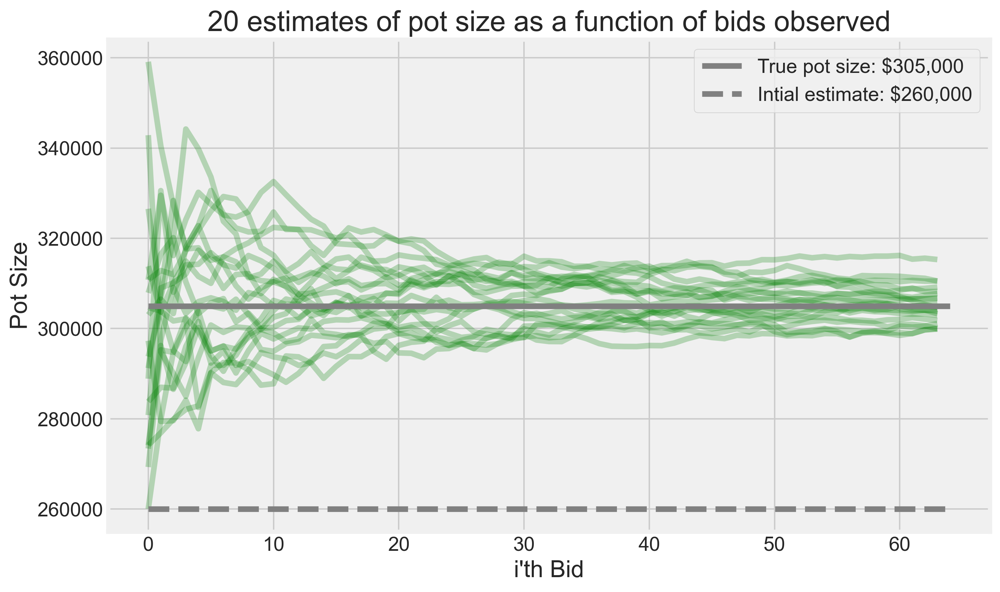

# Particle Filter Estimation for Auction Pot Size

## Overview

This repository contains a Python implementation of a particle filter designed to estimate the pot size in an auction setting, specifically tailored for situations where bids reflect the underlying value of items being auctioned (e.g., teams in a sports betting scenario) and the total pot size that accumulates from these bids. A particle filter is a powerful tool for sequential estimation that can handle non-linear models and non-Gaussian noise, making it ideal for the complex dynamics typically observed in auctions.

## Particle Filter Model

### Latent Transition and Update Mechanism

The latent transition of the particles is modeled using a Gaussian distribution to simulate the evolution of each particle's state. For each iteration, we predict the next state based on:

- **Prediction:** `particles[t+1] = particles[t] + N(0, sigma_process)`

Where `N(0, sigma_process)` represents Gaussian noise with mean 0 and standard deviation `sigma_process`, indicating process noise.

The update step incorporates observed bids to adjust the weights of the particles. The likelihood of observing a bid given a particle's state is modeled as:

- **Update:** `likelihood = N(observed_bid; particle * win_probability, sigma_measurement)`

Here, `N(observed_bid; mean, sigma_measurement)` represents the probability density of the observed bid given a normal distribution with mean `particle * win_probability` and standard deviation `sigma_measurement`, indicating measurement noise.

### Resampling Strategy

Systematic resampling is used to address degeneracy, ensuring that particles with higher weights are more likely to be selected for the next generation. This method contributes to focusing computational resources on the most probable states.

## Simulation Strategy

The model is tested through a simulation that generates observed bids based on a true pot value and a defined win probability. Observed bids are simulated using:

- **Simulation of Observed Bids:** `observed_bids = N(true_bid_value, bid_std)`

Where `N(true_bid_value, bid_std)` generates bids centered around the `true_bid_value` with standard deviation `bid_std`. The particle filter processes each bid sequentially, updating estimates of the pot size and refining the particles' distribution to converge towards the true pot value.

## Visualizations

To illustrate the performance and results of the particle filter, two key visualizations are generated at the bottom of the script:

1. **Time Series Estimation**: This graph shows the estimated pot size as a function of observed bids over time, comparing it to the true pot value.

   

2. **Kernel Density Estimate (KDE)**: A KDE plot visualizes the final distribution of particle states, with a vertical line marking the true pot size, showcasing the model's accuracy and uncertainty.

   

These visualizations provide insight into the model's dynamics, demonstrating its ability to adapt and refine the pot size estimate with each new bid observed.
