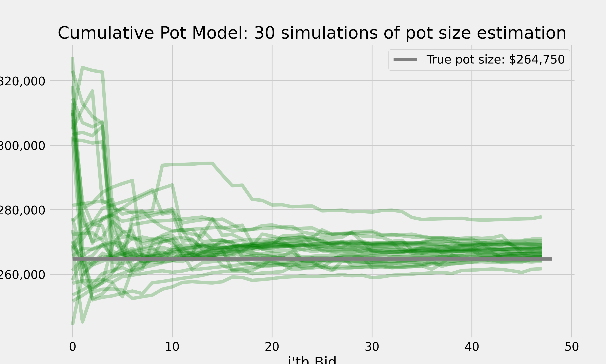
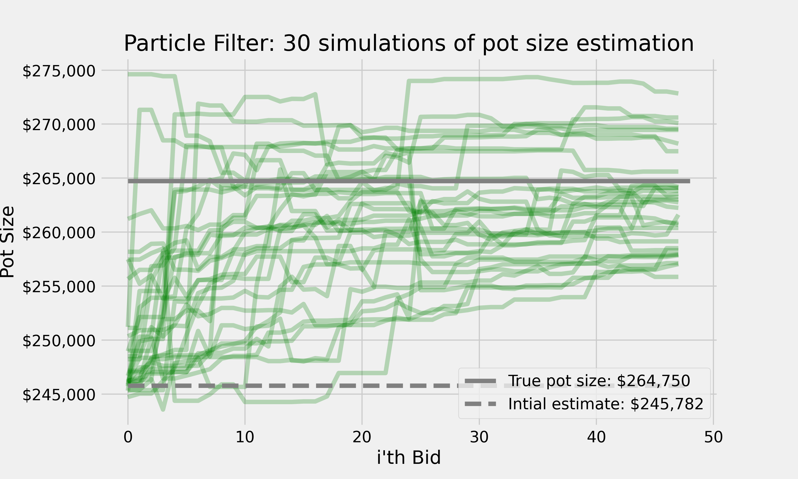
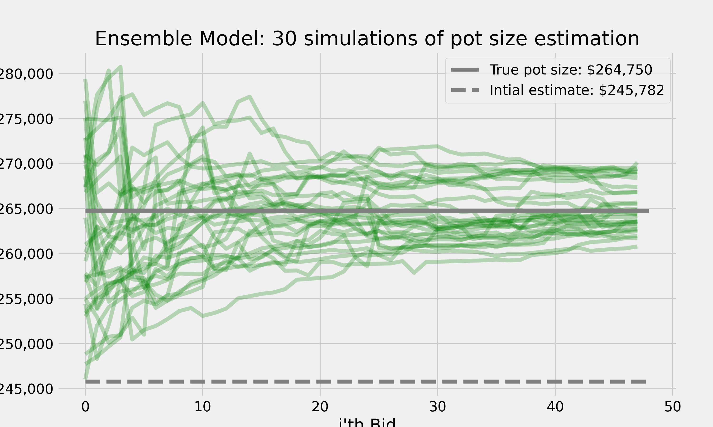
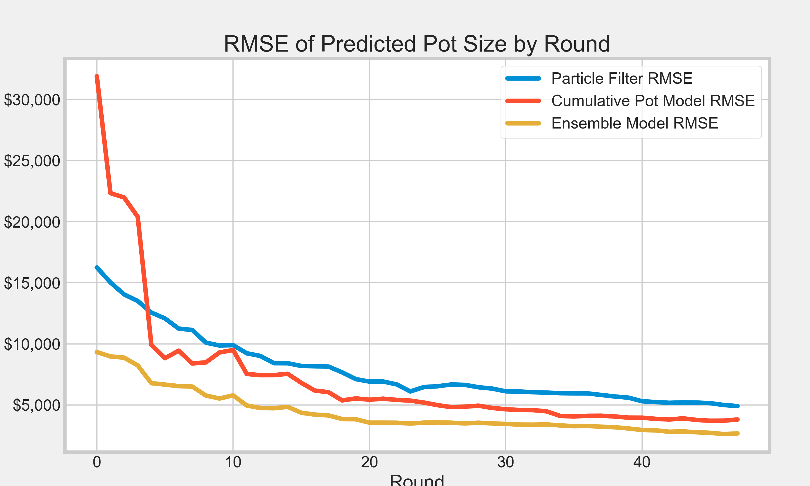

# Bayesian Estimation of Total Pot Size During Live Auctions

## Overview

This is a Python implementation of a particle filter designed to estimate the pot size in an auction setting, specifically tailored for situations where bids reflect the underlying value of items being auctioned (e.g., teams in a sports betting scenario) and the total pot size that accumulates as the sum of these indivdual bids. While bids should reflect some degree of consensus between teams there will be some noise introduced by slight variances in each bidders model, predicted pot sizes, personal prefences, risk tolerance, etc. These enviornmental complications makes the assumption that bids are generated by some latent process a reasonable well and makes this setting them well suited to be modeled with a particle filter--models that can handle non-linear models and non-Gaussian noise, making it ideal for the complex dynamics in our auction.

To ensure that this approach is sufficiently robust, the particle filter's estimates are averaged with a simple model that assumes the fraction of the pot observed so far is proportional to the total pot size. E.g., if ~24 teams who are expected to account for 50% of the returns of the pot have been observed and purchased for a total price of $50,000 then the predicted pot size will be $100,000.

By blending these two approaches the model is not overly reliant on potentially noisy bids in early rounds or ignornant to how the currently observed pot will impact the final pot size.

That said, the model will still be sensitive to its pre-set parameters, like the initial estimate of the pot-size and weighting between the particle filter and cumulative model. These variables can be tuned and estimated but are still a critical factor to the model's ability to generalize outside of the training/simulation data.

## Particle Filter Model

### Latent Transition and Update Mechanism

The latent transition of the particles is modeled using a Gaussian distribution to simulate the evolution of each particle's state. For each iteration, we predict the next state based on:

- **Prediction:** $particles[t+1] = particles[t] + N(0, \sigma_{process})$

Where $N(0, \sigma_{process})$ represents Gaussian noise with mean 0 and standard deviation $\sigma_{process}$, indicating process noise.

The update step incorporates observed bids to adjust the weights of the particles. The likelihood of observing a bid given a particle's state is modeled as:

- **Update:** $likelihood = N(\text{observed bid} | particle_i \cdot \theta_{\text{pot share}}, \sigma_{measurement})$

Here, $N(\text{observed bid} | \bar{pot}, \sigma_{measurement})$ is the probability density of the observed bid given a normal distribution with mean $\cdot \theta_{\text{pot share}}$ and standard deviation $\sigma_{measurement}$, indicating measurement noise.

### Resampling Strategy

Systematic resampling is used to address degeneracy, ensuring that particles with higher weights are more likely to be selected for the next generation. This method contributes to focusing computational resources on the most probable states.

## Simulation Strategy

The model is tested through a simulation that generates observed bids based on a true pot value and a defined win probability. Given the wide spread of bid values, generating realistic bids and predicted pot share values is non-trivial.

Bids are simulated in the following way:

**Win Counts Generation**: Utilizes the Negative Binomial distribution, parameterized by $r$ (the number of failures until the experiment is stopped) and $p$ (the probability of success in each experiment), to simulate the number of wins for each team.

**Share Calculation**: Converts win counts into shares of the total pot, ensuring that each team's share reflects its performance. The shares are initially scaled by a factor $\alpha$ and normalized to sum to one.

**Minimum Threshold Adjustment**: Guarantees that each bid meets or exceeds a minimum bid value by adjusting shares to respect a minimum share threshold, calculated as $\frac{\text{min bid value}}{\text{true pot value}}$.

**Noise Addition**: Introduces variability into the bid values through normally distributed noise, proportional to each bid's size, governed by bid_noise_percentage. Additional variance is introduced to bids at the minimum threshold, controlled by min_bid_noise_percentage.

**Bids Calculation**: Transforms shares into bid values relative to the true_pot_value, applying the noise adjustments to ensure realism and adherence to the minimum bid requirement.

The Negative Binomial distribution for win counts: $NB(r, p)$.

**The Scaled Shares are calculated as**: $\text{Scaled Shares} = \frac{\text{Win Counts}}{\sum \text{Win Counts}} \times \alpha$, normalized to ensure $\sum \text{Scaled Shares} = 1$.
Observed Bids with noise: $\text{Observed Bids} = \text{Scaled Shares} \times \text{True Pot Value} + \text{Noise}$, where Noise $\sim N(0, \text{Bid Noise Percentage} \times \text{Observed Bid})$.

- **Simulation of Observed Bids:** $observed_bids = $N(\text{true bid value}, \sigma_{bid})$

Where $N(\text{true bid value}, \sigma_{bid})$ generates bids centered around the $\text{true bid value}$ with standard deviation $\sigma_{bid}$. The particle filter processes each bid sequentially, updating estimates of the pot size and refining the particles' distribution to converge towards the true pot value.

## Visualizations

To illustrate the performance and results of the particle filter, two key visualizations are generated at the bottom of the script:

1. **Time Series Estimation**: These graph shows the estimated pot size as a function of observed bids over time, comparing it to the true pot value.

2. **Posterior Distribution**: A KDE plot visualizes the final distribution of particle states, which we can interpret as the posterior distribution of the model, with a vertical line marking the true pot size, showcasing the model's accuracy and uncertainty. 

3. **Model Weighting**: The particle filter and the cumulative model's respective estimates are turned into a weighted average where the weight given to each estimate in any given round is:

$$\beta_{\text{particle filter}} = 1 - \frac{\text{RMSE}_{\text{particle filter}}}{\text{Total RMSE in Round i}}$$

$$\beta_{\text{cumulative model}} = 1 - \beta_{\text{particle filter}}$$

4. **Model Error**: Leveraging an ensemble model: which simply takes a weighted average between the particle filter, much more accurate in early rounds, and the cumulative model, which is less suceptible to error as a result of highly variable bids, creates a fairly accurate estimate of the pot size in each round. In simulations the ensemble model can guess the pot size within +/- 5% after the first bid and then within +/- 2% after the first 5-10 bids.

